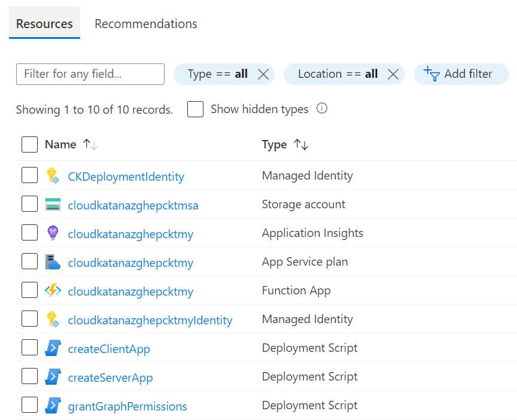

# Azure Resource Manager Template

## Authenticate to Azure

Use the Azure CLI command `az login` to authenticate to Azure AD with an account to deploy resources in Azure.

```PowerShell
az login --tenant xxxxxxxx-xxxx-xxxx-xxxx-xxxxxxxxxxxx
```

## Clone Project

```PowerShell
git clone https://github.com/Azure/Cloud-Katana
```

# Import Cloud Katana Tools PowerShell Module
This module is based on the [Cloud Katana abilities](https://www.powershellgallery.com/packages/CloudKatanaAbilities) module available in the project.

```PowerShell
Import-Module .\CloudKatanaTools.psm1 -Verbose
```

## Define Variables
We are going to define a few variables for the whole setup

```PowerShell
$AADPowerShellAppId = '1b730954-1685-4b74-9bfd-dac224a7b894'
$AzManagementUrl = 'https://management.azure.com'
$MSGraphUrl = 'https://graph.microsoft.com'
$SubscriptionId = '<SUBSCRIPTION-ID>'
$ResourceGroupName = '<RESOURCE-GROUP-NAME>' # If it doesn't exists, it is created
$FunctionAppName = (-join ('cloudkatana',-join ((65..90) + (97..122) | Get-Random -Count 10 | % {[char]$_}))).ToLower()
```

## Get Access Token for Azure Resource Management API
We need get an access token to use it with the Azure Resource Management API to create an Azure Resource Group and a User-Assigned Managed Identity to deploy Cloud Katana resources.

### Request a Device Code

Request a device code with the Azure Active Directory PowerShell application (app ID: `1b730954-1685-4b74-9bfd-dac224a7b894`) for the Azure Resource Management `https://management.azure.com`. To sign in, use a web browser to open the page https://microsoft.com/devicelogin and enter the code XXXX to authenticate

```PowerShell
$AzMgmtDCRequest = Get-CKDeviceCode -ClientId $AADPowerShellAppId -Resource $AzManagementUrl
$AzMgmtDCRequest
```
```
user_code        : XXXX
device_code      : XXXX
verification_url : https://microsoft.com/devicelogin
expires_in       : 900
interval         : 5
message          : To sign in, use a web browser to open the page https://microsoft.com/devicelogin and enter the code XXXX to authenticate.
```

# Retrieve Access Token

```PowerShell
$AzMgmtTokens = Get-CKAccessToken -ClientId $AADPowerShellAppId -Resource $AzManagementUrl -GrantType device_code -DeviceCode $AzMgmtDCRequest.device_code
$AzMgmtAccessToken = $AzMgmtTokens.access_token
```

## Create Resource Group

Create a resource group to deploy all Cloud Katana resources in it.

```PowerShell
$resourceGroup = New-CKAzResourceGroup -name $ResourceGroupName -location eastus -subscriptionId $SubscriptionId -accessToken $AzMgmtAccessToken
```

## Create a User Assigned Managed Identity

Besides using [Azure Functions](https://docs.microsoft.com/en-us/azure/azure-functions/functions-overview) to orchestrate attack simulations, Cloud Katana leverages the following resources for additional capabilities:
* `Azure AD application (Server)`: Enables authentication and authorization features via Azure AD.
* `Azure AD application (Client)`: A native application used to interact with Cloud Katana's serverless API. This is part of the authentication and authorization process.
* `User-assigned managed identity`: Facilitates the granular access control to other Azure AD protected resources. Permissions required to execute each simulation task need to be granted to the Cloud Katana's managed identity.

The registration of new Azure AD applications and permission grants are done via [custom scripts in the ARM template](https://docs.microsoft.com/en-us/azure/azure-resource-manager/templates/deployment-script-template). These custom scripts need to be executed under the security context of an identity with the right permissions to do so. Rather than passing credentials to the ARM template, we use a [user-assigned managed identity](https://docs.microsoft.com/en-us/azure/active-directory/managed-identities-azure-resources/how-manage-user-assigned-managed-identities?pivots=identity-mi-methods-azp).

```{note}
To create a user-assigned managed identity, your account needs the [Managed Identity Contributor role](https://docs.microsoft.com/en-us/azure/role-based-access-control/built-in-roles#managed-identity-contributor).
```

Run the following PowerShell commands to create a new user-assigned managed identity:

```PowerShell
$IdentityName = '<USER-ASSIGNED-MANAGED-IDENTITY>'
$Identity = New-CKAzADManagedIdentity -name $IdentityName -subscriptionId $SubscriptionId -resourceGroupName $ResourceGroupName -accessToken $AzMgmtAccessToken
```

## Get Access Token for Microsoft Graph API

We need get an access token to use it with the Microsoft Graph API to grant permissions to the User-Assigned Managed Identity, created in the previous step, to deploy Cloud Katana.

### Request a Device Code

Request a device code with the Azure Active Directory PowerShell application (app ID: 1b730954-1685-4b74-9bfd-dac224a7b894) for the Microsoft Graph `https://graph.microsoft.com`. To sign in, use a web browser to open the page https://microsoft.com/devicelogin and enter the code XXXX to authenticate

```PowerShell
$MSGraphDCRequest = Get-CKDeviceCode -ClientId $AADPowerShellAppId -Resource $MSGraphUrl
$MSGraphDCRequest
```
```
user_code        : XXXX
device_code      : XXXX
verification_url : https://microsoft.com/devicelogin
expires_in       : 900
interval         : 5
message          : To sign in, use a web browser to open the page https://microsoft.com/devicelogin and enter the code XXXX to authenticate.
```

# Retrieve Access Token

```PowerShell
$MSGraphTokens = Get-CKAccessToken -ClientId $AADPowerShellAppId -Resource $MSGraphUrl -GrantType device_code -DeviceCode $MSGraphDCRequest.device_code
$MSGraphAccessToken = $MSGraphTokens.access_token
```

## Grant Permissions to Managed Identity

Once the managed identity is created, we need to grant all the required permissions to register new Azure AD applications and grant permissions to the deployment managed identity. The following permissions must be granted:

* `Application.ReadWrite.All`: Allows the calling app to create, and manage (read, update, update application secrets and delete) applications and service principals without a signed-in user.
* `AppRoleAssignment.ReadWrite.All`: Allows the app to manage permission grants for application permissions to any API (including Microsoft Graph) and application assignments for any app, without a signed-in user.
* `DelegatedPermissionGrant.ReadWrite.All`: Allows the app to grant or revoke any delegated permission for any API (including Microsoft Graph), without a signed-in user.
* `User.Read.All`: Allows the app to read the full set of profile properties, group membership, reports and managers of other users in your organization, without a signed-in user.

**Reference**: [https://docs.microsoft.com/en-us/graph/permissions-reference#application-permissions-4](https://docs.microsoft.com/en-us/graph/permissions-reference#application-permissions-4)

```PowerShell
Grant-CKAzADAppPermissions -spObjectId $Identity.properties.principalId -resourceName 'Microsoft Graph' -Permissions @('Application.ReadWrite.All','AppRoleAssignment.ReadWrite.All','DelegatedPermissionGrant.ReadWrite.All','User.Read.All') -permissionType application -accessToken $MSGraphAccessToken -verbose
```

## Deploy ARM Template

Deploy Cloud Katana to Azure with the `azuredeploy.json` ARM template available at the root of the project's folder. You can run the template with [Azure CLI](https://docs.microsoft.com/en-us/cli/azure/what-is-azure-cli) or a `Deploy` button (One-click deployment).

### Azure CLI

```PowerShell
$identityId = $identity.id
$assignAppRoleToUser = 'USER@DOMAIN.COM'

az deployment group create --template-file azuredeploy.json --resource-group $resourceGroup --parameters functionAppName=$functionAppName identityId=$identityId assignAppRoleToUser=$assignAppRoleToUser
```

### Deploy Button

You can also click on the button `Deploy` below and provide the `required` parameter values used in the previous Azure CLI deployment section.

[](https://portal.azure.com/#create/Microsoft.Template/uri/https%3a%2f%2fraw.githubusercontent.com%2fAzure%2fCloud-Katana%2fmain%2fazuredeploy.json)

## Monitor Deployment

Go to [https://portal.azure.com](https://portal.azure.com/) > `<RESOURCE-GROUP-NAME>` > `Deployments` to monitor the deployment of Cloud Katana's resources:


If you go back to your resource group, you will see everything that is being created:



You can click, for example, on one of the `deployment scripts` artifacts and inspect the logs to see what the scripts is doing as shown below:


Finally, when the Cloud Katana Azure function is deployed, you can go back to your group resources and click on the `Function App` resource. Then, you can click on `Functions` and you will be able to explore all the Azure functions associated with the Cloud Katana serverless API.


Let's click on the `Activity Function` named `Azure`. This one is used to execute actions in Azure. Next, click on `Code +Test` to look at the code behind the activity function.


That's it!