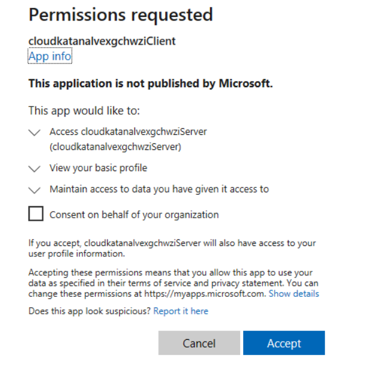

# Demos

## Requirements

### Install Microsoft Authentication Libraries (MSAL)

Locally, open PowerShell as Administrator and run the following commands to install and import the PowerShell MSAL.PS moule:

```PowerShell
Install-PackageProvider NuGet -Force
Install-Module PowerShellGet -Force -AllowClobber

Install-Module -name MSAL.PS -Force -AcceptLicense
Import-Module MSAL.PS
```

### Set Variables

```PowerShell
$functionAppName = 'FUNCTION-APP-NAME'
$azureFunctionUrl = "https://$functionAppName.azurewebsites.net"
$OrchestratorUrl = "$azureFunctionUrl/api/orchestrators/Orchestrator"
```

### Get Function App Access Token

```PowerShell
$cloudkatanaClientAPPId = 'xxxx'
$tenantId = 'xxxx'

$results = Get-FuncAppToken -AppId $cloudkatanaClientAPPId -FunctionAppUrl $azureFunctionUrl -TenantId $tenantId -verbose
$accessToken = $results.AccessToken
```

The first time you use Cloud Katana, you will have to accept the permissions requested to access the Azure AD application exposing Cloud Katana APIs and enabling authentication and authorization via Azure AD. Click `Accept` and you will get an access token back to use while interacting with Cloud Katana's serverless API:



### Set Authorization Header

```PowerShell
$headers = @{
  Authorization = "Bearer $accessToken"
}
```

## Examples: Single Actions

### Get All Azure AD Users

```PowerShell
# HTTP Body
$body = @{
  activityFunction = 'Azure'
  type = 'action'
  action = 'Get-CKAzADUsers'
} | ConvertTo-Json -Depth 4

# Execute Simulation
$simulationResults = Invoke-RestMethod -Method Post -Uri $OrchestratorUrl -Body $body -Headers $headers -ContentType 'application/json'
$simulationResults

# Sleep
Start-Sleep -s 5

# Explore Results
$outputResults = (Invoke-RestMethod -Uri $simulationResults.statusQueryGetUri -Headers $headers).output | ConvertFrom-Json
$outputResults | Where-Object {$_.userPrincipalName -like '*simulandlabs*'} | Select-Object userPrincipalName
```

### Get All Azure AD Applications

```PowerShell
# HTTP Body
$body = @{
  activityFunction = 'Azure'
  type = 'action'
  action = 'Get-CKAzADApplication'
} | ConvertTo-Json -Depth 4

# Execute Simulation
$simulationResults = Invoke-RestMethod -Method Post -Uri $OrchestratorUrl -Body $body -Headers $headers -ContentType 'application/json'
$simulationResults

# Sleep
Start-Sleep -s 5

# Process Results
$outputResults = (Invoke-RestMethod -Uri $simulationResults.statusQueryGetUri -Headers $headers).output | ConvertFrom-Json
$outputResults | Select-Object displayName
```

### Update Application Credentials

```PowerShell
# HTTP Body
$body = @{
  activityFunction = 'Azure'
  type = 'action'
  action = 'Add-CKAzADAppPassword'
  parameters = @{
    appObjectId = 'AZURE-AD-APP-OBJECT-ID'
    displayName = 'BlackHatSecret'
  }
} | ConvertTo-Json -Depth 4

# Execute Simulation
$simulationResults = Invoke-RestMethod -Method Post -Uri $OrchestratorUrl -Body $body -Headers $headers -ContentType 'application/json'
$simulationResults

# Sleep
Start-Sleep -s 5

# Process Results
$outputResults = (Invoke-RestMethod -Uri $simulationResults.statusQueryGetUri -Headers $headers).output | ConvertFrom-Json
$outputResults | Format-list
```

### Get User's Mailbox

```PowerShell
# HTTP Body
$body = @{
  activityFunction = 'Azure'
  type = 'action'
  action = 'Get-CKMailboxMessages'
  parameters = @{
    userPrincipalName = 'USER-NAME@DOMAIN.com'
  }
} | ConvertTo-Json -Depth 10

# Execute Simulation
$simulationResults = Invoke-RestMethod -Method Post -Uri $OrchestratorUrl -Body $body -Headers $headers -ContentType 'application/json'
$simulationResults

# Sleep
Start-Sleep -s 5

# Process Results
$outputResults = (Invoke-RestMethod -Uri $simulationResults.statusQueryGetUri -Headers $headers).output | ConvertFrom-Json
$outputResults | select bodyPreview
```

## Examples: Workflow

A Workflow is a sequence of steps that allows the operationalization of a simulation plan. Each step contains metadata such as the name of the activity function, action and parameters required to execute code. Steps are executed in order and some depend on the output of other steps in the workflow.

### Add Credentials to an App, Grant Permissions, Get a Token and Read Mail

We are sharing a few workflows in the [workflows](https://github.com/Azure/Cloud-Katana/tree/main/workflows) folder for you to use for testing and inspiration:

**Read Workflow JSON File**

```PowerShell
cd Cloud-Katana\

$doc = Get-Content .\workflows\Az-UpdateAppAndReadMail.json -raw
```

Explore the content of the variable `$doc` and identify all the variables that need to be set for the simulation before execution. The variables follow the same syntax as a PowerShell variable (`$variable`).

```PowerShell
$doc
```

```PowerShell
{
  "name": "Update Azure AD application and read mail",
  "type": "workflow",
  "description": "Grant permissions to Azure AD application, add credentials to an Azure AD application, get an access token with the new credentials from the Azure AD application and read mail from a specific user via MS Graph with the security context of the Azure AD application",
  "contributors": [
    "Roberto Rodriguez @Cyb3rWard0g"
  ],
  "steps":[
    {
      "name": "GrantMailPermissions",
      "activityFunction": "Azure",
      "action": "Grant-CKPermissions",
      "parameters": {
        "spObjectId": "$spObjectId",
        "resourceName": "Microsoft Graph",
        "permissionType": "Application",
        "permissions": ["Mail.Read"]
      }
    },
    {
      "name": "AddPasswordToApp",
      "activityFunction": "Azure",
      "action": "Add-CKAzADAppPassword",
      "parameters": {
        "appObjectId": "$appObjectId",
        "displayName": "$pwdCredentialName"
      },
      "wait": "30s"
    },
    {
      "name": "GetAccessToken",
      "activityFunction": "Azure",
      "action": "Get-CKAccessToken",
      "dependsOn": [
        "AddPasswordToApp"
      ],
      "parameters": {
        "ClientId": "$appId",
        "TenantId": "$tenantId",
        "GrantType": "client_credentials",
        "AppSecret": "#{output}.AddPasswordToApp.secretText"
      }
    },
    {
      "name": "GetMailboxMessages",
      "activityFunction": "Azure",
      "action": "Get-CKMailboxMessages",
      "dependsOn": [
        "GetAccessToken"
      ],
      "parameters": {
        "accessToken": "#{output}.GetAccessToken.access_token",
        "userPrincipalName": "$userPrincipalName"
      }
    }
  ]
}
```

**Set Variables**

For the workflow above, we need the following variables:

```PowerShell
$appObjectId = 'xxxx-xxxx-xxxx-xxxx' # Application to add creentials to
$spObjectId = 'xxxx-xxxx-xxxx-xxxx' # Service principal to grant permissions to
$pwdCredentialName = 'MyNewSecret' # name of credentials added to the application
$appId = 'xxxx-xxxx-xxxxx-xxxxx' # application id (client_id) to authenticate to
$tenantId = 'xxxx-xxxx-xxxx-xxxx' # ID of tenant to authenticate to with the new credentials
$userPrincipalName = 'wardog@domain.onmicrosoft.com' # user to collect e-mails from (Mailbox messages)
```

The following pattern `#{output}` is used to reference/access the output results of specific steps during the execution of other steps in the workflow.

For example, `#{output}.GetAccessToken.access_token` means:

* Get the output of the step `GetAccessToken`
* Filter output and only return the value of the property `access_token`

Output of every single step is saved in a dictionary represented as the variable `$output` in the execution context of the `Orchestrator`.  The `$output` variable (Dictionary) uses the name of steps as `keys` in the dictionary. This allows other steps to reference output based on the step name.

**Expand / Substitute Variables on Document**

After defining variables, we can use the [$ExecutionContext.InvokeCommand.ExpandString()](https://docs.microsoft.com/en-us/powershell/scripting/learn/deep-dives/everything-about-string-substitutions?view=powershell-7.1#executioncontext-expandstring) method to substitute variables in our current workflow.

The call to `.InvokeCommand.ExpandString` on the current execution context uses the variables in the current scope for substitution. This method allows us to define a substitution string with single quotes and expand the variables later.

```PowerShell
$body = $ExecutionContext.InvokeCommand.ExpandString($doc)
```

**Run Workflow**

Once the JSON object is ready, use it as the `$body` of the HTTP request. Make sure to set the `ContentType` to `application/json`.

```PowerShell
$simulationResults = Invoke-RestMethod -Method Post -Uri $OrchestratorUrl -Body $body -ContentType 'application/json' -Headers $headers
```

**Process Output**

The output of a worflow is a `dictionary` with `keys` named after each step in the workflow.

```PowerShell
$outs = (Invoke-RestMethod -Uri $SimulationResults.statusQueryGetUri -Headers $headers).Output
```

```PowerShell
$outs | Get-Member | Where-Object {$_.MemberType -eq 'NoteProperty'}


   TypeName: System.Management.Automation.PSCustomObject

Name                 MemberType   Definition
----                 ----------   ----------
AddPasswordToApp     NoteProperty string AddPasswordToApp={...
GetAccessToken       NoteProperty string GetAccessToken={...
GetMailboxMessages   NoteProperty string GetMailboxMessages=[...
GrantMailPermissions NoteProperty string GrantMailPermissions={...
```

**Access Output**

The output in each `key` is in JSON as shown below:

```PowerShell
$outs.GrantMailPermissions

{
  "appRoleId": "xxxxxxxx-xxxx-xxxx-xxxx-xxxxxxxxxx",
  "createdDateTime": "2021-09-10T18:59:06.2791293Z",
  "principalId": "xxxxxxxx-xxxx-xxxx-xxxx-xxxxxxxxxx",
  "id": "xxxxxxxxxxxxxxxxxxxxxxxxxxxxxx",
  "principalDisplayName": "SimuLandApp",
  "deletedDateTime": null,
  "principalType": "ServicePrincipal",
  "resourceDisplayName": "Microsoft Graph",
  "resourceId": "xxxxxxxx-xxxx-xxxx-xxxx-xxxxxxxxxx",
  "@odata.context": "https://graph.microsoft.com/v1.0/$metadata#servicePrincipals('xxxxxxxx-xxxx-xxxx-xxxx-xxxxxxxxxx')/appRoleAssignments/$entity",
  "@odata.id": "https://graph.microsoft.com/v2/xxxxxxxx-xxxx-xxxx-xxxx-xxxxxxxxxx/directoryObjects/$/Microsoft.DirectoryServices.ServicePrincipal('xxxxxxxx-xxxx-xxxx-xxxx-xxxxxxxxxx')/appRoleAssignments/xxxxxxxxxxxxxxxxxxxxxxxxxxxxxx"
}
```

You can convert each output into `PSCustomObject` objects with the [ConvertFrom-Json](https://docs.microsoft.com/en-us/powershell/module/microsoft.powershell.utility/convertfrom-json?view=powershell-7.1) cmdlet.

```PowerShell
$grants = $outs.GrantMailPermissions | ConvertFrom-Json
$grants
```

Let's inspect messages from the Mailbox:

```PowerShell
$messages = $outs.GetMailboxMessages | ConvertFrom-Json
$messages | Select-Object subject
```

```
subject
-------
Check out the latest Power Automate updates, success stories, and learning
Azure AD Identity Protection Weekly Digest
Azure AD Identity Protection Weekly Digest
DC01: Health service data is not up to date.  – You have an important alert from Azure Active Directory
Azure AD Identity Protection Weekly Digest
```
