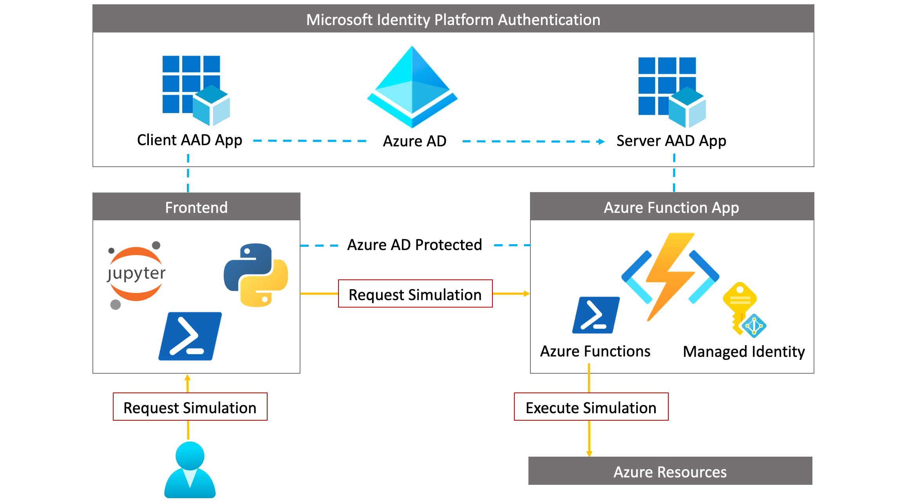

# Cloud Katana

Unlocking Serverless Computing to Assess Security Controls

## About

Cloud Katana is a cloud native tool developed from the need to automate simulation steps on-demand in multi-cloud and hybrid cloud environments. This tool is an event-driven, serverless compute application built on the top of [Azure Functions](https://docs.microsoft.com/en-us/azure/azure-functions/functions-overview) that expedites the research process and validation of security controls.

## Docs Structure

This website is built with Jupyter Book and is organized into a few major sections!

::::{grid} 1 1 2 3
:class-container: text-center
:gutter: 3

:::{grid-item-card}
:link: deploy/azure/intro
:link-type: doc
:class-header: bg-light

Getting Started 🚀
^^^

Step-by-step guides to install Cloud Katana and run a few demos.
:::

:::{grid-item-card}
:link: learn/principles/intro
:link-type: doc
:class-header: bg-light

Design Principles 🎁
^^^

Sections covering specific areas in more depth.

:::

:::{grid-item-card}
:link: simulate/azure/intro
:link-type: doc
:class-header: bg-light

Azure Simulations ⚡
^^^

Run a few simulations against Azure resources.
:::

::::

## Contributing

:::{admonition} Learn more and get involved
:class: tip full-width

💡 [Open an issue](https://github.com/Azure/Cloud-Katana/issues/new/choose)
: We track enhancement requests, bug-reports, and to-do items via GitHub issues.

💬 [Join the discussion](https://github.com/Azure/Cloud-Katana/discussions)
: We have community discussions, talk about ideas, and share general questions and feedback in our [GitHub discussions space](https://github.com/Azure/Cloud-Katana/discussions).

🙌 Join the community
: Cloud Katana partners with the [Open Threat Research (OTR) community](https://twitter.com/OTR_Community) to meet other passionate security researchers willing to collaborate and contribute back.
  Get an automatic invitation to the [OTR Discord Server here](https://discord.com/invite/efBGmbQ)!.
  We welcome anyone to join us in improving Cloud Katana and helping one another learn more about assessing security controls via serverless computing.
:::
