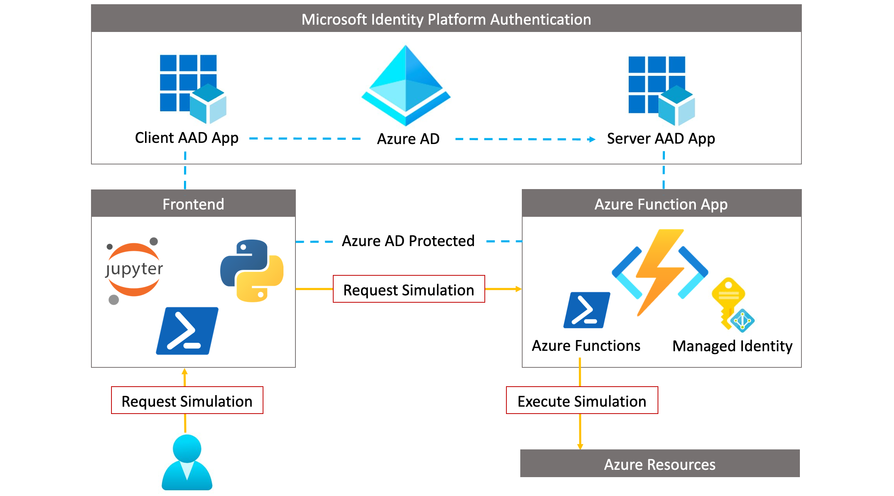
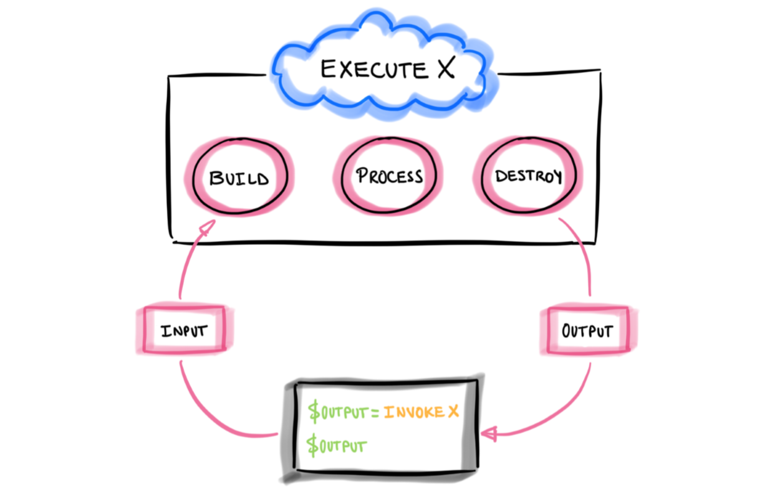
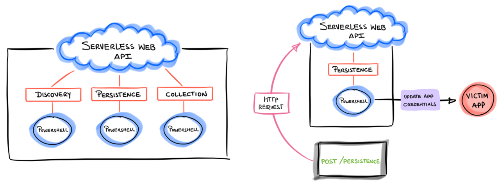
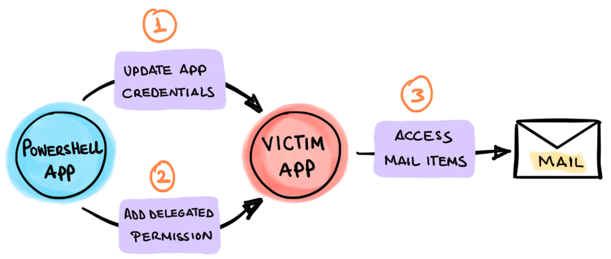
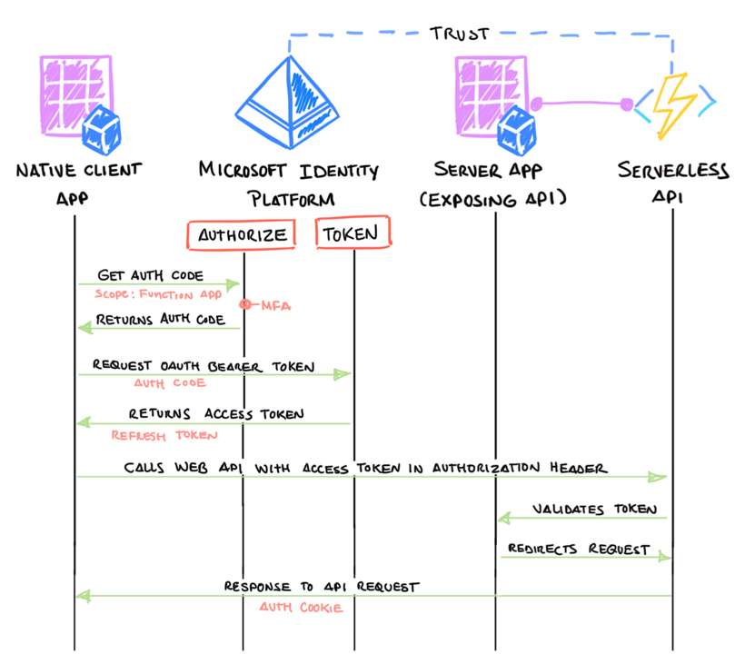
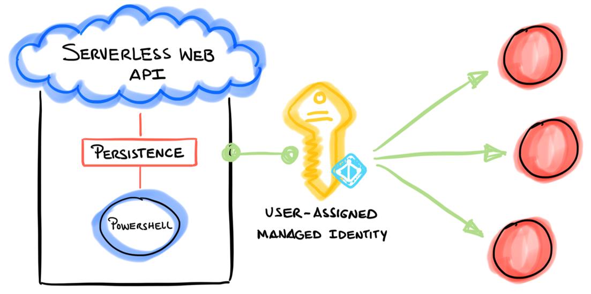
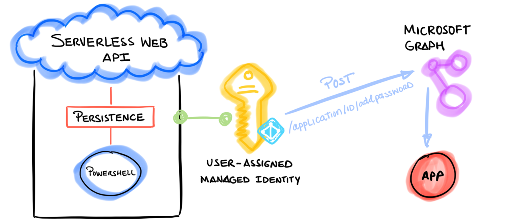
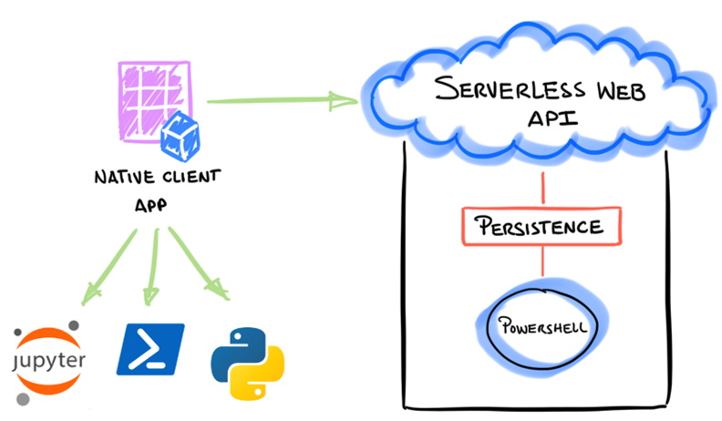
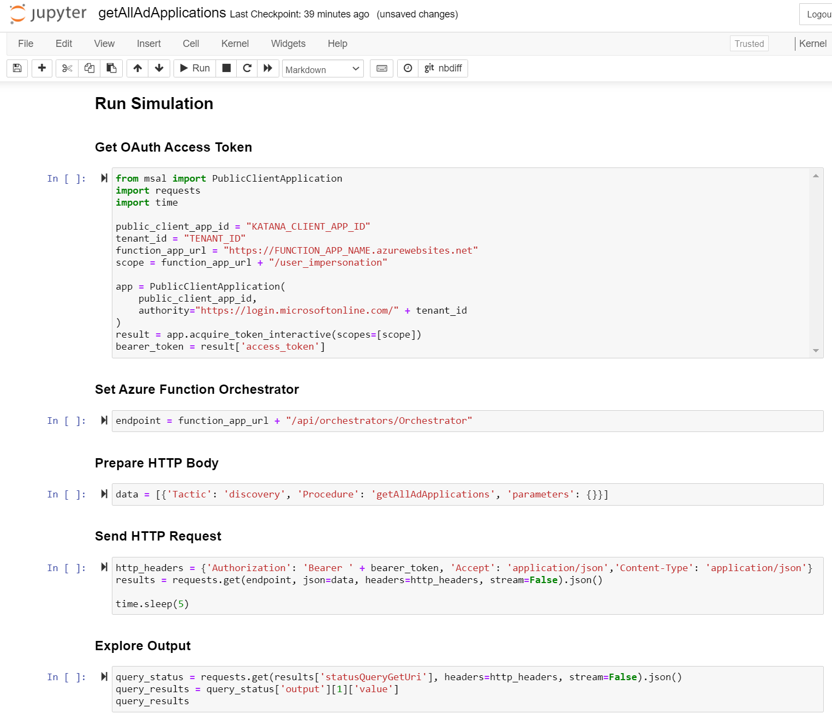
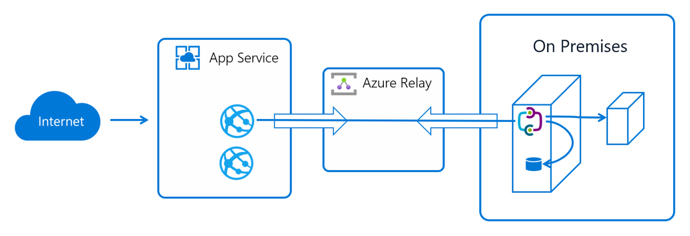

# Design Principles

* A serverless execution model
* Compute on-demand as a web API
* JSON based format to document attack scenarios
* Orchestrated stateful execution
* Secure authentication and authorization
* Managed identity integration
* Granular access control
* Programming language agnostic clients
* Cloud and on-prem coverage

## A “serverless” execution model 

Cloud Katana is a cloud-native solution that relies on platform as a service (PaaS) concepts to provide a simplified and scalable event-driven solution without worrying about deploying and maintaining the underlying infrastructure used to execute simulations. 

To meet this need, Cloud Katana uses [Azure Functions](https://docs.microsoft.com/en-us/azure/azure-functions/functions-overview) to abstract the operating system layer from the code through a pay-per-execution billing model that automatically scales based on trigger invocations.

## Compute on-demand as a Web API 

Simulation steps are represented as blocks of code called "functions" and invoked via HTTP requests through a built-in serverless web API.  

With this feature one could simply send an HTTP request with information about the specific simulation and wait for the infrastructure underneath to process the request. Currently, all functions are written in PowerShell (subject to change) and categorized following the MITRE ATT&CK framework.

## JSON based attack scenarios 

Every attack scenario is documented in JSON format to aggregate metadata such as title, description, ATT&CK mappings, expected input and output and even preconditions to make sure we have the right permissions before running a simulation step. This facilitates the processing of every documented action programmatically and the automatic setup of a few other resources.

[Explore Attack Scenarios Schema](../schema.md)

## Orchestrated stateful execution 

The project is also designed to handle state and ensure reliability across numerous attack simulations by using an extension of Azure functions named [durable functions](https://docs.microsoft.com/en-us/azure/azure-functions/durable/durable-functions-overview?tabs=powershell). This feature allows the orchestration and execution of scenarios where actions could depend on the state and output of other simulation steps. This is good to define specific attack paths as code.

## Secure Authentication and Authorization 

Cloud Katana also enforces authentication and authorization best practices to secure the application.  

### Authentication 

The project uses the [Microsoft Identity Platform](https://docs.microsoft.com/en-us/azure/active-directory/develop/v2-overview) (a.k.a Azure AD) as its identity provider to authenticate clients. This feature requires a registered Azure AD application which allows users to connect to the Azure Function app using OAuth authentication. 

In addition, using an identity provider enables the following features: 

* Conditional access policies
* The use of [multi-factor authentication](https://docs.microsoft.com/en-us/azure/active-directory/authentication/concept-mfa-howitworks)
* Single sign-on (SSO) 

### Authorization 

Besides enforcing users to authenticate before executing simulations, the project also implements “Application Role Assignments” to restrict access to selected users. This allows organizations to select who can use the project in their environments. 

## Managed Identities Integration 

Furthermore, when executing simulations in Azure, Cloud Katana uses a user-assigned managed identity to access and interact with other Azure AD-protected resources. One of the advantages of managed identities is that it removes the need to provision or rotate any secrets.

## Granular access control to Azure Resources 

In addition, access to Azure resources is defined by the permissions assigned to the managed identity. We currently cover Azure based scenarios. Therefore, we use permissions associated with [each major set of Microsoft Graph APIs](https://docs.microsoft.com/en-us/graph/permissions-reference) to control access to specific Azure resources. 

For example, if we wanted to use Cloud Katana to add credentials to an application, we would need to grant the [following permissions](https://docs.microsoft.com/en-us/graph/api/application-addpassword?view=graph-rest-1.0&tabs=http#permissions) (From least to most privileged) to the managed identity: 

* Application.ReadWrite.OwnedBy
* Application.Read.Write.All

## Programming language agnostic clients 

Another feature that makes Cloud Katana a very powerful tool is the flexibility to use any programming language to request simulations. If the client used to interact with Cloud Katana can handle the Azure AD authentication process, it does not matter how the simulation is requested.

Microsoft Authentication libraries are available via PowerShell as [MSAL.PS](https://github.com/AzureAD/MSAL.PS) and Python as [MSAL](https://pypi.org/project/msal/) . We could also use other open-source projects such as [Jupyter Notebooks](https://jupyter.org/) to create repetitive templates to show the execution of simulations and share the process with other security researchers.

## Cloud and on-prem simulations 

Finally, we are currently experimenting with [Azure App Service Hybrid Connections](https://docs.microsoft.com/en-us/azure/app-service/app-service-hybrid-connections) to not only run simulations in the cloud, but also on-premises. Hybrid Connections use a [relay agent](https://docs.microsoft.com/en-us/azure/azure-relay/relay-what-is-it) to securely expose services that run on-premises to the public cloud.  The relay agent sits in the middle between the on-prem server and the Cloud Katana Azure Function app. 

A relay agent ( [Hybrid Connection Manager (HCM)](https://docs.microsoft.com/en-us/azure/app-service/app-service-hybrid-connections#hybrid-connection-manager) ) is set up on the on-prem server and configured to call out to the Azure Relay over port 443. The Cloud Katana function app then connects to the Azure Relay to interact with the on-prem server and execute simulations locally. The connection uses TLS 1.2 for security and shared access signature (SAS) keys for authentication and authorization.

