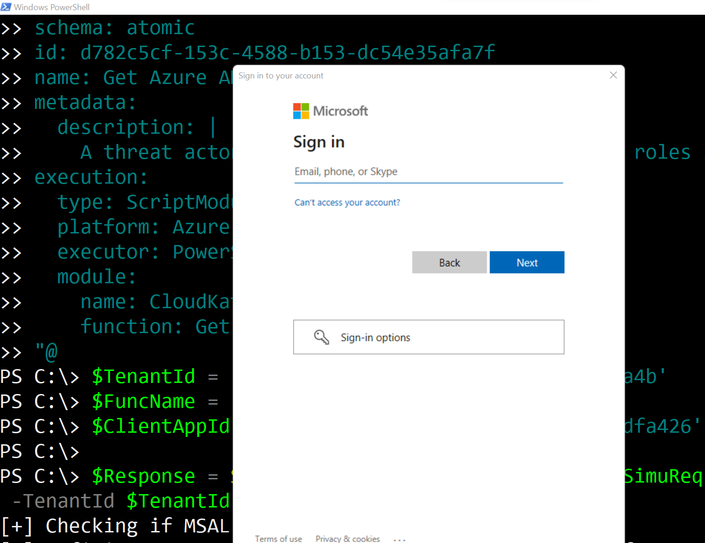
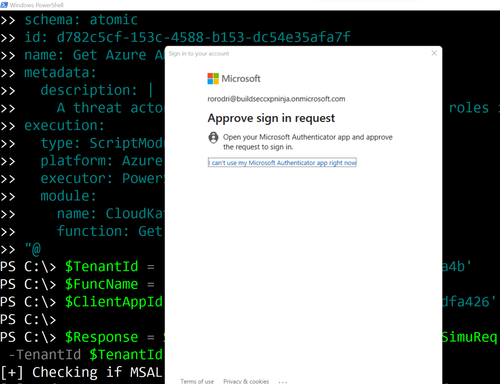
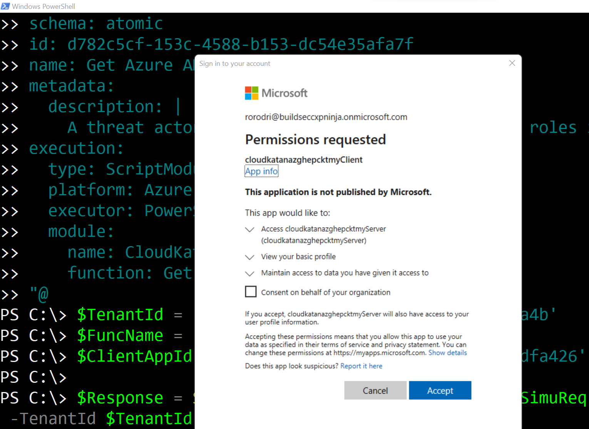
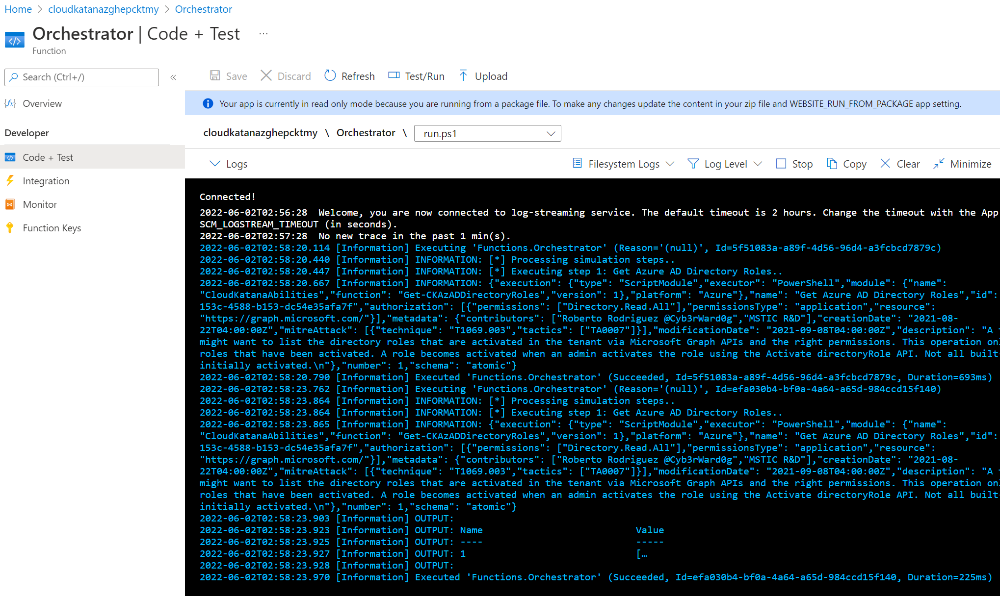
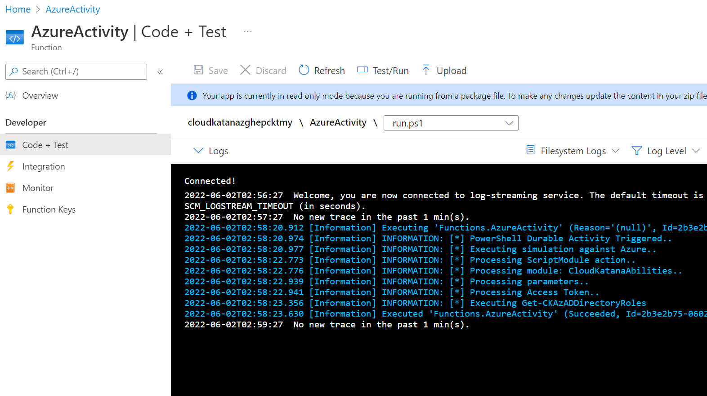

# Request Simulations

## Import Cloud Katana Tools Module

```PowerShell
Import-Module .\CloudKatanaTools.psm1
```

## Set Cloud Katana Variables

```PowerShell
$TenantId = '<TENANT-ID>'
$FuncName = '<FUNCTION-APP-NAME>'
$ClientAppId = '<CLIENT-APP-ID>'
```

## Define Simulation Request

Whether you want to run an atomic or campaign simulation, you can define it as a JSON object in the following ways:

### Local JSON Strings

```PowerShell
$SimuReq = [ordered]@{
  "id" = "attackscenario-d782c5cf-153c-4588-b153-dc54e35afa7f"
  "name" = "Admin promotion via Directory Role Permission Grant"
  "metadata" = @{
      "creationDate" = "2021-11-01"
      "modificationDate" = "2022-05-01"
      "platform" = @(
          "Azure"
      )
      "description" = "Get Azure AD Directory Roles"
      "contributors" = @(
          "Roberto Rodriguez @Cyb3rWard0g"
      )
      "mitreAttack" = @(
        @{
          "technique" = "T1580"
          "tactics" = @(
            "TA0007"
          )
        }
      )
    }
    "authorization" = @(
      @{
        "resource" = "https://graph.microsoft.com/"
        "permissionsType" = "application"
        "permissions" = @(
          "Directory.Read.All"
        )
      }
    )
    "steps" = @(
      @{
        "number" = 1
        "name" = "AddPasswordToAADApp"
        "execution" = @{
          "type" = "ScriptModule"
          "platform" = "Azure"
          "executor" = "PowerShell"
          "module" = @{
              "name" = "CloudKatanaAbilities"
              "version" = "1.3.1"
              "function" = "Get-CKAzADDirectoryRoles"
          }
        }
      }
    )
} | ConvertTo-Json -depth 5
```

### Remote JSON Strings

The project comes with several examples that you can use directly from its [GitHub repository](https://github.com/Azure/Cloud-Katana):


```PowerShell
$SimuReq = (Invoke-WebRequest -Uri 'https://raw.githubusercontent.com/Azure/Cloud-Katana/main/scenarios/azure/AADLightDiscovery/ScenarioDeploy.json').ToString()
```

### Local JSON File

You can use the JSON string from the previous sections and save it as a `.json` file.

```PowerShell
$simuReq = (get-item .\scenarios\azure\AADLightDiscovery\ScenarioDeploy.json).FullName
```

## Request Simulation

Use the `Start-CKTSimulation` function available in the `CloudKatanaTools` module to request a simulation.

### JSON Strings

```PowerShell
$Response = Start-CKTSimulation -JsonStrings $SimuReq -FunctionAppName $FuncName -TenantId $TenantId -CloudKatanaAppId $ClientAppId
```

### JSON File

```PowerShell
$Response = Start-CKTSimulation -Path $SimuReq -FunctionAppName $FuncName -TenantId $TenantId -CloudKatanaAppId $ClientAppId
```

## Authenticate

While the previous step is running, you will get a login prompt to authenticate






## Accept Permissions Requested (One Time)

The first time you use Cloud Katana, you will have to accept the permissions requested to access the Azure AD application exposing Cloud Katana APIs and enabling authentication and authorization via Azure AD. Click `Accept`.



## Monitor Azure Function Logs

Browse to your [Azure Portal](https://portal.azure.com/) > Resource Group > Cloud Katana Function App > Functions

### Orchestrator Logs



### Activity Functions Logs



## Inspect Output / Response

In our example, we saved the response to variable `$Response`

```PowerShell
$Response

Name                           Value
----                           -----
output                         {1}
name                           Orchestrator
instanceId                     203c649f-5771-431f-b15e-7b1411a4d001
createdTime                    2022-06-02T02:58:19Z
input                          @{steps=System.Object[]; Metadata=; Name=Get Azure AD ...
lastUpdatedTime                2022-06-02T02:58:23Z
runtimeStatus                  Completed
```

The response contains a key named `output`. The value of output is a collection of dictionaries.

```PowerShell
$response.output['1']
```

That's It!

